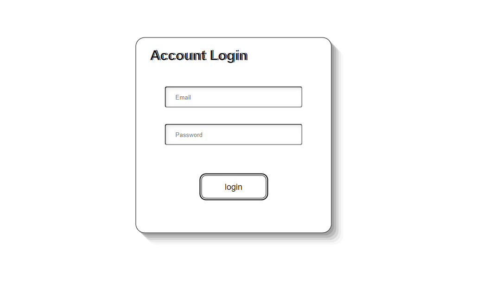

# **登入系統**

實作帳號密碼登入功能

&nbsp;
## **專案功能**

* 根據帳號密碼驗證使用者身分
* 正確時進入個人頁面
* 錯誤時顯示輸入錯誤
* 保存登入狀態

&nbsp;
## **環境建置與需求**

* [Node.js](https://nodejs.org/en/) - v16.14.2


&nbsp;
## **安裝與執行步驟**

> 下載或複製專案後

１.在專案資料夾中使用終端機

```properties
cd '專案資料夾路徑'
```

２.安裝node套件

```properties
npm install
```

３.執行專案
> node
```properties
npm run start
```

> nodemon(視需求)

```properties
npm run dev
```

４.在瀏覽器上瀏覽專案

```
http://localhost:3000
```

專案啟動成功時，終端機輸出
```
Listening on http://localhost:3000
```


&nbsp;
## **專案畫面**


